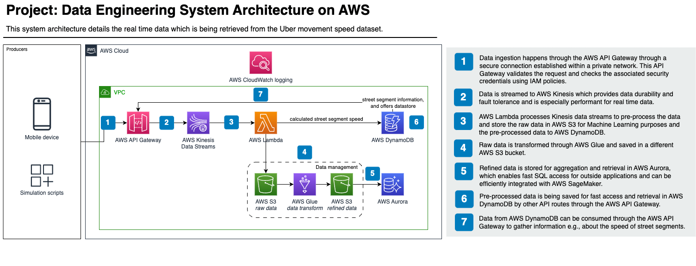

# uber-movement

This project was created to create a real-time data architecture based on AWS services.

This project was realized with the following technologies:

`JavaScript`, `TypeScript`, `Node`, `Python`, `Go`, `localstack`

## Architecture



## Running locally

To run the project locally, you will need to have `docker` and `docker-compose` installed.
There are two way to run the project locally, one is to run the project with the help of
`docker-compose` and the other is to run the project manually.

### Prerequisites

Because this project uses `localstack` to mock AWS services, you will need to have a
`localstack` pro account because this architecture uses `Aurora`, `Glue`, and the 
`API Gateway v2`.

Add an `.env` file to the root of the project with the following contents:

```
LOCALSTACK_API_KEY=XXX
```

### Running with docker-compose

A prerequisite to running the project with `docker-compose` is that you **do not** have
the `localstack` CLI installed.

To run the project with `docker-compose`, you can run the following command:
  
```sh
$ ./localstack.sh
```

This will start the `localstack` infrastructure and run the main file which creates all
the necessary services and connections to achieve the desired architecture. Besides that,
it also builds the `lambda` functions and deploys them to `localstack`.

### Running manually

A prerequisite to running the project manually is that you **do** have the `localstack`
CLI, `Node`, `pnpm`, `Python`, and `Go` installed.

To run the project manually, you can run the following commands:

```sh
$ localstack start
```

This will start the `localstack` infrastructure. After that, you can run the following
command to create the necessary services and connections to achieve the desired
architecture:

```sh
$ cd services/kinesis_data_forwarder && pnpm i && pnpm build && cd ../..
$ cd services/dynamo_getter && ./build.sh && cd ../..
$ cd services/preprocessing && ./build.sh && cd ../..
$ go run main.go
```

## Testing the architecture

To check if the architecture is working as expected, you can run the simulation and test
the functionality with some smaller scripts. To run the simulation, you can run the
following command:

```sh
$ python3 simulation/simulate_data.py
```

This will start the simulation and send data to the `kinesisDataForwarder` lambda function
through the API Gateway over WebSocket, which forwards the data to `Kinesis`. After that,
the `Preprocessing` lambda function gets triggered by the `Kinesis` stream and processes
the data. The processed data is then stored in `DynamoDB` and `S3` (bucket is named
`raw-data` and stored as `csv` files). The `DynamoGetter` lambda function can then
be triggered by a GET request through the API Gateway and returns the specific data based 
on the `id` querystring parameter.

For data processing for machine learning tasks, the data can be processed to `Aurora` and
a separate `S3` bucket (named `transformed-data` and stored as `csv` files) by a `Glue`
job. The `Glue` job is already deployed but still needs to be run manually. To interact
with the `Glue` job, you can run the following command:

```sh
$ python3 services/glue/job.py [start|stop|logs]
```

To check the correct insertion of the data, you can use the following scripts to check the
data in `DynamoDB` or `Aurora`:
  
```sh
$ ./scripts/check-aurora-sql-data.sh
$ ./scripts/check-dynamodb-data.sh
```

## Want to use the AWS cli?

If you would like to use the AWS cli to interact with the running localstack instance,
you can do so by running the following command:

```sh
$ aws --endpoint-url=http://localhost:4566 <command>
```

It is also important to note that you will need to configure your region to be on
`us-east-1` for local testing.

## Credits

- [Uber Movement](https://movement.uber.com/)